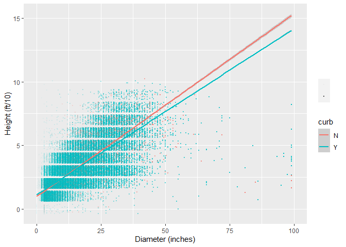
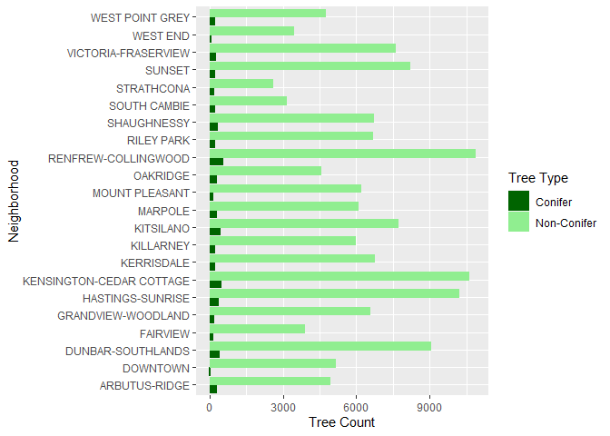
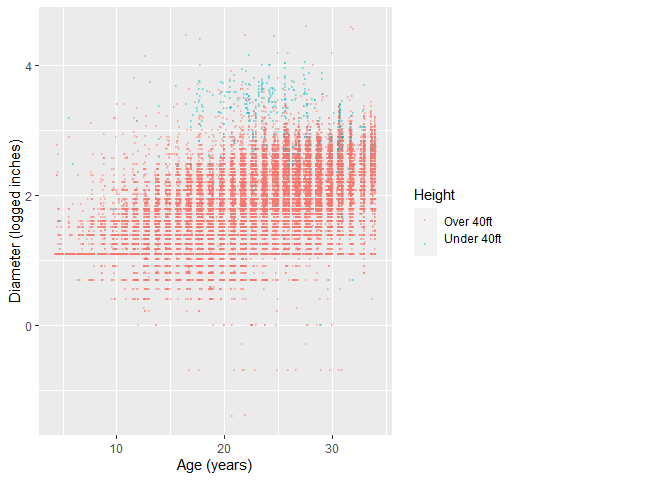
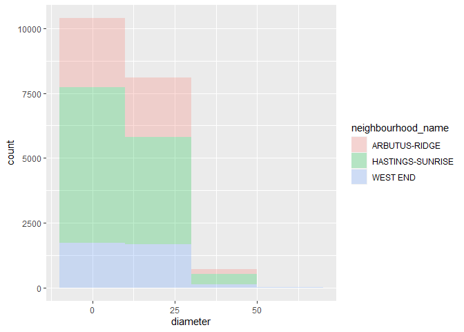
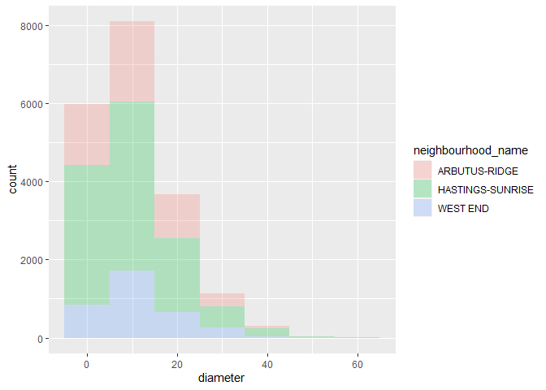
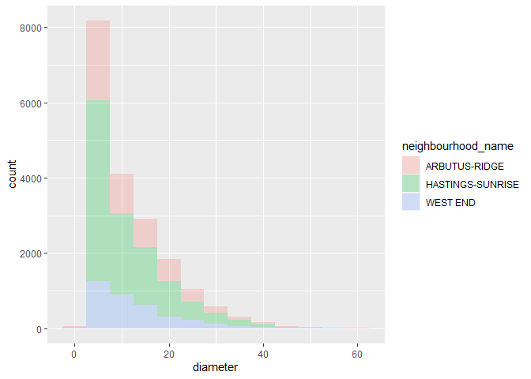

Mini Data Analysis Milestone 2
================

*To complete this milestone, you can either edit [this `.rmd`
file](https://raw.githubusercontent.com/UBC-STAT/stat545.stat.ubc.ca/master/content/mini-project/mini-project-2.Rmd)
directly. Fill in the sections that are commented out with
`<!--- start your work here--->`. When you are done, make sure to knit
to an `.md` file by changing the output in the YAML header to
`github_document`, before submitting a tagged release on canvas.*

# Welcome to the rest of your mini data analysis project!

In Milestone 1, you explored your data. and came up with research
questions. This time, we will finish up our mini data analysis and
obtain results for your data by:

- Making summary tables and graphs
- Manipulating special data types in R: factors and/or dates and times.
- Fitting a model object to your data, and extract a result.
- Reading and writing data as separate files.

We will also explore more in depth the concept of *tidy data.*

**NOTE**: The main purpose of the mini data analysis is to integrate
what you learn in class in an analysis. Although each milestone provides
a framework for you to conduct your analysis, it’s possible that you
might find the instructions too rigid for your data set. If this is the
case, you may deviate from the instructions – just make sure you’re
demonstrating a wide range of tools and techniques taught in this class.

# Instructions

**To complete this milestone**, edit [this very `.Rmd`
file](https://raw.githubusercontent.com/UBC-STAT/stat545.stat.ubc.ca/master/content/mini-project/mini-project-2.Rmd)
directly. Fill in the sections that are tagged with
`<!--- start your work here--->`.

**To submit this milestone**, make sure to knit this `.Rmd` file to an
`.md` file by changing the YAML output settings from
`output: html_document` to `output: github_document`. Commit and push
all of your work to your mini-analysis GitHub repository, and tag a
release on GitHub. Then, submit a link to your tagged release on canvas.

**Points**: This milestone is worth 50 points: 45 for your analysis, and
5 for overall reproducibility, cleanliness, and coherence of the Github
submission.

**Research Questions**: In Milestone 1, you chose two research questions
to focus on. Wherever realistic, your work in this milestone should
relate to these research questions whenever we ask for justification
behind your work. In the case that some tasks in this milestone don’t
align well with one of your research questions, feel free to discuss
your results in the context of a different research question.

# Learning Objectives

By the end of this milestone, you should:

- Understand what *tidy* data is, and how to create it using `tidyr`.
- Generate a reproducible and clear report using R Markdown.
- Manipulating special data types in R: factors and/or dates and times.
- Fitting a model object to your data, and extract a result.
- Reading and writing data as separate files.

# Setup

Begin by loading your data and the tidyverse package below:

``` r
library(datateachr) # <- might contain the data you picked!
library(tidyverse)
```

# Task 1: Process and summarize your data

From milestone 1, you should have an idea of the basic structure of your
dataset (e.g. number of rows and columns, class types, etc.). Here, we
will start investigating your data more in-depth using various data
manipulation functions.

### 1.1 (1 point)

First, write out the 4 research questions you defined in milestone 1
were. This will guide your work through milestone 2:

<!-------------------------- Start your work below ---------------------------->

1)  Which neighborhood has the biggest trees?
2)  Are older trees larger?
3)  Are conifers more popular than non-conifers?
4)  Do curbs affect tree growth vigor?
    <!----------------------------------------------------------------------------->

Here, we will investigate your data using various data manipulation and
graphing functions.

### 1.2 (8 points)

Now, for each of your four research questions, choose one task from
options 1-4 (summarizing), and one other task from 4-8 (graphing). You
should have 2 tasks done for each research question (8 total). Make sure
it makes sense to do them! (e.g. don’t use a numerical variables for a
task that needs a categorical variable.). Comment on why each task helps
(or doesn’t!) answer the corresponding research question.

Ensure that the output of each operation is printed!

Also make sure that you’re using dplyr and ggplot2 rather than base R.
Outside of this project, you may find that you prefer using base R
functions for certain tasks, and that’s just fine! But part of this
project is for you to practice the tools we learned in class, which is
dplyr and ggplot2.

**Summarizing:**

1.  Compute the *range*, *mean*, and *two other summary statistics* of
    **one numerical variable** across the groups of **one categorical
    variable** from your data.
2.  Compute the number of observations for at least one of your
    categorical variables. Do not use the function `table()`!
3.  Create a categorical variable with 3 or more groups from an existing
    numerical variable. You can use this new variable in the other
    tasks! *An example: age in years into “child, teen, adult, senior”.*
4.  Compute the proportion and counts in each category of one
    categorical variable across the groups of another categorical
    variable from your data. Do not use the function `table()`!

**Graphing:**

6.  Create a graph of your choosing, make one of the axes logarithmic,
    and format the axes labels so that they are “pretty” or easier to
    read.
7.  Make a graph where it makes sense to customize the alpha
    transparency.

Using variables and/or tables you made in one of the “Summarizing”
tasks:

8.  Create a graph that has at least two geom layers.
9.  Create 3 histograms, with each histogram having different sized
    bins. Pick the “best” one and explain why it is the best.

Make sure it’s clear what research question you are doing each operation
for!

<!------------------------- Start your work below ----------------------------->

``` r
vancouver_trees <- vancouver_trees %>%
  mutate(age = (Sys.Date()-vancouver_trees$date_planted)/365) #from Milestone1
vancouver_trees <- vancouver_trees %>%  #I calculated age in Milestone1 but the vector was in difftime, not numeric
  mutate(age_num = as.numeric(age))
vancouver_trees2 <- vancouver_trees %>% 
  filter(diameter <100) #some diameters seemed like an incorrect measurement so trying to get rid of the outliers
```

#### Do curbs affect tree growth vigor?

2.  Compute the number of observations for at least one of your
    categorical variables. Do not use the function `table()`! This was
    useful to know how the magnitude of measurements for the two
    categories differ
3.  Make a graph where it makes sense to customize the alpha
    transparency.
4.  Create a graph that has at least two geom layers. This graph
    fulfills both of these requirements. I added the lm line to the
    graph because there are so many points, it’s hard to see the trends
    in the data. Additionally, I customized the alpha so that the large
    cluster of points had a much lower alpha transparency than the
    non-clustered points. Otherwise the clustered points were either way
    too dark or the non-clustered points were really hard to see.

``` r
# group by curb to find number of curb trees
trees_curb <- vancouver_trees2 %>% 
  group_by(curb) %>% 
  summarise(curb_count = n())
print(trees_curb)
```

    ## # A tibble: 2 × 2
    ##   curb  curb_count
    ##   <chr>      <int>
    ## 1 N          12802
    ## 2 Y         133799

``` r
# comparing diameter vs height, grouped by curb or no curb  
ggplot(vancouver_trees2, aes(diameter, height_range_id, colour = curb)) +
  geom_point( position = "jitter", aes(alpha=diameter),size=.5) +
  geom_smooth(method = "lm") +
  xlim(0,100) +
  scale_alpha(range = c(0.01,1), breaks = c(1,50,100), n.breaks=2, name=NULL,label=NULL) +
  xlab("Diameter (inches)") +
  ylab("Height (ft/10)")
```

    ## `geom_smooth()` using formula = 'y ~ x'

    ## Warning: Removed 54 rows containing missing values (`geom_point()`).

<!-- -->

``` r
 #geom_hex
```

#### Are conifers more popular than non-conifers?

4.  Compute the proportion and counts in each category of one
    categorical variable across the groups of another categorical
    variable from your data. Do not use the function `table()`! This was
    super helpful and pretty much completely answers the research
    question. ?. None of the graph options seemed to make sense for this
    question, but it was useful to learn how to make a bar graph with
    two x measurements for each y measurement.

``` r
#need to make a column for each observation stating if it is a conifer or not (based on what I found in Model 1)

trees_species <- vancouver_trees2 %>% 
  filter(!is.na(genus_name)) %>% 
  mutate(con_or_non = case_when(genus_name %in% c( "ABIES","ARAUCARIA", "CEDRUS","CALOCEDRUS","CRYPTOMERIA","CHAMAECYPARIS","CUPRESSOCYPARIS   ","JUNIPERUS","METASEQUOIA","PICEA","PINUS","PSEUDOTSUGA","SCIADOPITYS","SEQUOIA","SEQUOIADENDRON","TAXODIUM","TAXUS","THUJA","TSUGA") ~ "Conifer",
  !genus_name %in% c( "ABIES","ARAUCARIA", "CEDRUS","CALOCEDRUS","CRYPTOMERIA","CHAMAECYPARIS","CUPRESSOCYPARIS",
                      "JUNIPERUS","METASEQUOIA","PICEA","PINUS","PSEUDOTSUGA","SCIADOPITYS","SEQUOIA","SEQUOIADENDRON",
                      "TAXODIUM","TAXUS","THUJA","TSUGA") ~ "Non-Conifer"))
 
#now I can find the counts of conifers and non-conifers for each neighbourhood
trees_species2 <- trees_species %>% 
  group_by(neighbourhood_name, con_or_non) %>%
  select(neighbourhood_name, con_or_non) %>%
  summarise(con_count = n()) %>%
  group_by(neighbourhood_name) %>%
  mutate(sum = sum(con_count)) %>%
  mutate(proportion = con_count/sum)
```

    ## `summarise()` has grouped output by 'neighbourhood_name'. You can override
    ## using the `.groups` argument.

``` r
print(trees_species2)
```

    ## # A tibble: 44 × 5
    ## # Groups:   neighbourhood_name [22]
    ##    neighbourhood_name con_or_non  con_count   sum proportion
    ##    <chr>              <chr>           <int> <int>      <dbl>
    ##  1 ARBUTUS-RIDGE      Conifer           255  5169    0.0493 
    ##  2 ARBUTUS-RIDGE      Non-Conifer      4914  5169    0.951  
    ##  3 DOWNTOWN           Conifer            26  5158    0.00504
    ##  4 DOWNTOWN           Non-Conifer      5132  5158    0.995  
    ##  5 DUNBAR-SOUTHLANDS  Conifer           394  9414    0.0419 
    ##  6 DUNBAR-SOUTHLANDS  Non-Conifer      9020  9414    0.958  
    ##  7 FAIRVIEW           Conifer           117  4002    0.0292 
    ##  8 FAIRVIEW           Non-Conifer      3885  4002    0.971  
    ##  9 GRANDVIEW-WOODLAND Conifer           157  6703    0.0234 
    ## 10 GRANDVIEW-WOODLAND Non-Conifer      6546  6703    0.977  
    ## # ℹ 34 more rows

``` r
#represnt it graphically
ggplot(trees_species2, aes(con_count, neighbourhood_name)) +
  geom_bar(stat="identity", aes(colour = con_or_non, fill = con_or_non), position = "dodge") +
  scale_fill_manual(values=c("darkgreen","lightgreen"),aesthetics = c("colour", "fill"), name="Tree Type") +
  xlab("Tree Count") +
  ylab("Neighborhood")
```

<!-- -->

#### Are older trees larger?

3.  Create a categorical variable with 3 or more groups from an existing
    numerical variable. You can use this new variable in the other
    tasks! *An example: age in years into “child, teen, adult, senior”.*
    This is useful because I can use look at relative size for each age
    group, as trees grow at different rates depending on if they are
    fully established.
4.  Create a graph of your choosing, make one of the axes logarithmic,
    and format the axes labels so that they are “pretty” or easier to
    read. It didn’t really make sense for me to use something that was
    logarithmic here because diameter measurements were not differeing
    by orders of magnitude

``` r
#Make a column for age from date_planted and then set up bins
vancouver_trees2 <- vancouver_trees2 %>%  #I calculated age in Milestone1 but the vector was in difftime, not numeric
  mutate(age_num = as.numeric(age)) 
range(vancouver_trees2$age_num, na.rm = TRUE) #what is the spread of the data so I can decide bin sizes
```

    ## [1]  4.309589 34.010959

``` r
trees_age <- vancouver_trees2 %>% 
  filter(!is.na(age), diameter>0) %>%
  mutate(age_bins=cut(age_num, breaks = c(-Inf,10,20,Inf), labels=c("sappling", "young", "mature"))) %>% 
  mutate(ftcut=cut(height_range_id, breaks = c(-Inf,4,Inf), labels = c("Over 40ft", "Under 40ft
                                                                       ")))

#Look at age vs logged diameter. I chose to make 2 categories, over 40ft and under 40ft in height to see if there seemed to be some trend in diameter age and height
ggplot(trees_age, aes(age_num, log(diameter))) +
  geom_point(alpha=.3, size=.5, position = "jitter", aes(colour=ftcut)) +
  xlab("Age (years)") +
  ylab("Diameter (logged inches)") +
  scale_color_discrete(name="Height")
```

<!-- -->

#### Which neighborhood has the biggest trees?

1.  Compute the *range*, *mean*, and *two other summary statistics* of
    **one numerical variable** across the groups of **one categorical
    variable** from your data. This is is helpful because I can look at
    the spread of the data and to start understand how I want to answer
    the question.
2.  Create 3 histograms, with each histogram having different sized
    bins. Pick the “best” one and explain why it is the best. This
    wasn’t the most helpful, but it was good to see how most trees are
    in one general size class, with only a few trees deviating from
    that. This made me start to realize that the diameter column had
    values that did not make sense (diameter of 11 m)

``` r
#group diameter by neighborhood and run summary statistics
biggest_trees <- vancouver_trees2 %>% 
  group_by(neighbourhood_name) %>%
  filter(diameter > 0, age_num > 10) %>% #some trees had a zero dbh, which either means that the tree was not yet 1.35m (height of DBH) or was not measured and filtered out implausible measurements, set age >10 because I wanted trees that have had some time to establish
  summarise(diam_min = min(diameter), #min
         diam_max = max(diameter), #max
         diam_mean = mean(diameter), #mean
         diam_sd = sd(diameter), #standard deviation
         diam_median = median(diameter)) #median


#Make 3 histograms with different bin sizes, I also chose to layer the 3 neighborhoods with the highest diameter mean to compare across them.
diam_filtered <- filter(vancouver_trees2, neighbourhood_name%in%c("HASTINGS-SUNRISE","ARBUTUS-RIDGE", "WEST END"), diameter>0) #Top three highest mean, also trying to get rid of the large number of really small trees in the data set
ggplot(diam_filtered, aes(diameter, fill=neighbourhood_name)) +
  geom_histogram(alpha=0.25, binwidth = 20)
```

<!-- -->

``` r
ggplot(diam_filtered, aes(diameter, fill=neighbourhood_name)) +
  geom_histogram(alpha=0.25, binwidth = 10)
```

<!-- -->

``` r
ggplot(diam_filtered, aes(diameter, fill=neighbourhood_name)) +
  geom_histogram(alpha=0.25, binwidth = 5)
```

<!-- -->
<!----------------------------------------------------------------------------->

### 1.3 (2 points)

Based on the operations that you’ve completed, how much closer are you
to answering your research questions? Think about what aspects of your
research questions remain unclear. Can your research questions be
refined, now that you’ve investigated your data a bit more? Which
research questions are yielding interesting results?

<!------------------------- Write your answer here ---------------------------->

1)  Which neighborhood has the biggest trees?
2)  Are older trees larger?
3)  Are conifers more popular than non-conifers?
4)  Do curbs affect tree growth vigor?

Questions 2 and 3 feel pretty much answered from this data exploration.
I could dive further into these questions by looking at how things
differ by neighborhood (for Q3) or expand what “larger” means (for Q2).
Questions 1 and 4 are more interesting questions to continue to look at.
For the neighborhood with the largest trees, I can look at overall
tallest tree or overall largest diameter or which neighborhood has the
highest mean of these categories. For how curbs affect tree growth
vigor, I want to see if the diameter and height of trees the same age
differ by being curbed or not. I think there are a lot of variable at
play here though, because tree species will play a large factor in these
things.

<!----------------------------------------------------------------------------->

# Task 2: Tidy your data

In this task, we will do several exercises to reshape our data. The goal
here is to understand how to do this reshaping with the `tidyr` package.

A reminder of the definition of *tidy* data:

- Each row is an **observation**
- Each column is a **variable**
- Each cell is a **value**

### 2.1 (2 points)

Based on the definition above, can you identify if your data is tidy or
untidy? Go through all your columns, or if you have \>8 variables, just
pick 8, and explain whether the data is untidy or tidy.

<!--------------------------- Start your work below --------------------------->

``` r
#select 8 variables
tidy_trees <- vancouver_trees %>% 
  select(c(tree_id, genus_name, neighbourhood_name, plant_area, curb, height_range_id, diameter, age_num))
glimpse(tidy_trees)
```

    ## Rows: 146,611
    ## Columns: 8
    ## $ tree_id            <dbl> 149556, 149563, 149579, 149590, 149604, 149616, 149…
    ## $ genus_name         <chr> "ULMUS", "ZELKOVA", "STYRAX", "FRAXINUS", "ACER", "…
    ## $ neighbourhood_name <chr> "MARPOLE", "MARPOLE", "KENSINGTON-CEDAR COTTAGE", "…
    ## $ plant_area         <chr> "N", "N", "4", "4", "4", "B", "6", "6", "3", "3", "…
    ## $ curb               <chr> "N", "N", "Y", "Y", "Y", "Y", "Y", "Y", "Y", "Y", "…
    ## $ height_range_id    <dbl> 2, 4, 3, 4, 2, 2, 3, 3, 2, 2, 2, 5, 3, 2, 2, 2, 2, …
    ## $ diameter           <dbl> 10.00, 10.00, 4.00, 18.00, 9.00, 5.00, 15.00, 14.00…
    ## $ age_num            <dbl> 24.79178, 27.41370, 29.93699, 27.50137, 29.86849, N…

For the most part, the data is tidy. There are some NA’s in the age
category, which meant that there was no record for date planted. But
otherwise, each row is an observation, each column is a variable, and
each cell has a value.
<!----------------------------------------------------------------------------->

### 2.2 (4 points)

Now, if your data is tidy, untidy it! Then, tidy it back to it’s
original state.

If your data is untidy, then tidy it! Then, untidy it back to it’s
original state.

Be sure to explain your reasoning for this task. Show us the “before”
and “after”.

<!--------------------------- Start your work below --------------------------->

``` r
glimpse(tidy_trees) #before
```

    ## Rows: 146,611
    ## Columns: 8
    ## $ tree_id            <dbl> 149556, 149563, 149579, 149590, 149604, 149616, 149…
    ## $ genus_name         <chr> "ULMUS", "ZELKOVA", "STYRAX", "FRAXINUS", "ACER", "…
    ## $ neighbourhood_name <chr> "MARPOLE", "MARPOLE", "KENSINGTON-CEDAR COTTAGE", "…
    ## $ plant_area         <chr> "N", "N", "4", "4", "4", "B", "6", "6", "3", "3", "…
    ## $ curb               <chr> "N", "N", "Y", "Y", "Y", "Y", "Y", "Y", "Y", "Y", "…
    ## $ height_range_id    <dbl> 2, 4, 3, 4, 2, 2, 3, 3, 2, 2, 2, 5, 3, 2, 2, 2, 2, …
    ## $ diameter           <dbl> 10.00, 10.00, 4.00, 18.00, 9.00, 5.00, 15.00, 14.00…
    ## $ age_num            <dbl> 24.79178, 27.41370, 29.93699, 27.50137, 29.86849, N…

``` r
#untidy the data
untidy_trees <- tidy_trees %>%  #going to combine age and height 
  unite("age_height", c(height_range_id, age_num), sep = ":")
glimpse(untidy_trees) #after
```

    ## Rows: 146,611
    ## Columns: 7
    ## $ tree_id            <dbl> 149556, 149563, 149579, 149590, 149604, 149616, 149…
    ## $ genus_name         <chr> "ULMUS", "ZELKOVA", "STYRAX", "FRAXINUS", "ACER", "…
    ## $ neighbourhood_name <chr> "MARPOLE", "MARPOLE", "KENSINGTON-CEDAR COTTAGE", "…
    ## $ plant_area         <chr> "N", "N", "4", "4", "4", "B", "6", "6", "3", "3", "…
    ## $ curb               <chr> "N", "N", "Y", "Y", "Y", "Y", "Y", "Y", "Y", "Y", "…
    ## $ age_height         <chr> "2:24.7917808219178", "4:27.413698630137", "3:29.93…
    ## $ diameter           <dbl> 10.00, 10.00, 4.00, 18.00, 9.00, 5.00, 15.00, 14.00…

``` r
#tidy the data

tidy_trees <- untidy_trees %>% 
  separate(age_height, c("height_range_id", "age_num"), ":") %>% 
  filter(!is.na(age_num)) #remove NA values
glimpse(tidy_trees) #after
```

    ## Rows: 146,611
    ## Columns: 8
    ## $ tree_id            <dbl> 149556, 149563, 149579, 149590, 149604, 149616, 149…
    ## $ genus_name         <chr> "ULMUS", "ZELKOVA", "STYRAX", "FRAXINUS", "ACER", "…
    ## $ neighbourhood_name <chr> "MARPOLE", "MARPOLE", "KENSINGTON-CEDAR COTTAGE", "…
    ## $ plant_area         <chr> "N", "N", "4", "4", "4", "B", "6", "6", "3", "3", "…
    ## $ curb               <chr> "N", "N", "Y", "Y", "Y", "Y", "Y", "Y", "Y", "Y", "…
    ## $ height_range_id    <chr> "2", "4", "3", "4", "2", "2", "3", "3", "2", "2", "…
    ## $ age_num            <chr> "24.7917808219178", "27.413698630137", "29.93698630…
    ## $ diameter           <dbl> 10.00, 10.00, 4.00, 18.00, 9.00, 5.00, 15.00, 14.00…

<!----------------------------------------------------------------------------->

### 2.3 (4 points)

Now, you should be more familiar with your data, and also have made
progress in answering your research questions. Based on your interest,
and your analyses, pick 2 of the 4 research questions to continue your
analysis in the remaining tasks:

<!-------------------------- Start your work below ---------------------------->

1.  Do curbs affect tree growth vigor?
2.  Which neighborhood has the biggest trees?

<!----------------------------------------------------------------------------->

Explain your decision for choosing the above two research questions.

<!--------------------------- Start your work below --------------------------->

Of the four questions I originally proposed, these seem like the two
that do not have a simple answer. For Question 1, there can be several
ways in which we can look at tree growth vigor, ie diameter or height
linked to curb planting, heights at different age classes, best height
to diameter ratio. Similarly, for Question 2, there can be lots of ways
to try to answer the question. I could look at which neighborhood has
the single tallest tree, or widest tree. But I could also see how the
neighborhoods do without outliers. For both questions, I get to try
analyzing the data in a variety of ways and can start thinking about
when to decide that the right variables are being considered.
<!----------------------------------------------------------------------------->

Now, try to choose a version of your data that you think will be
appropriate to answer these 2 questions. Use between 4 and 8 functions
that we’ve covered so far (i.e. by filtering, cleaning, tidy’ing,
dropping irrelevant columns, etc.).

(If it makes more sense, then you can make/pick two versions of your
data, one for each research question.)

<!--------------------------- Start your work below --------------------------->

``` r
vancouver_trees2 <- vancouver_trees %>% #tidying the data
  mutate(age = as.numeric(Sys.Date()-vancouver_trees$date_planted)/365) %>% #create age column
  select(c(tree_id, genus_name, species_name, neighbourhood_name, curb, height_range_id, diameter, age)) %>% #drop irrelevant columns
  filter(!is.na(age), diameter < 100) %>%  #get rid of NA values and unlikely measurements
  unite("full_name", c(genus_name, species_name)) #getting full scientific name for each tree, can be good to compare heights/diameter across species
```

# Task 3: Modelling

## 3.0 (no points)

Pick a research question from 1.2, and pick a variable of interest
(we’ll call it “Y”) that’s relevant to the research question. Indicate
these.

<!-------------------------- Start your work below ---------------------------->

**Research Question**: Do curbs affect tree growth vigor?

**Variable of interest**: diameter

<!----------------------------------------------------------------------------->

## 3.1 (3 points)

Fit a model or run a hypothesis test that provides insight on this
variable with respect to the research question. Store the model object
as a variable, and print its output to screen. We’ll omit having to
justify your choice, because we don’t expect you to know about model
specifics in STAT 545.

- **Note**: It’s OK if you don’t know how these models/tests work. Here
  are some examples of things you can do here, but the sky’s the limit.

  - You could fit a model that makes predictions on Y using another
    variable, by using the `lm()` function.
  - You could test whether the mean of Y equals 0 using `t.test()`, or
    maybe the mean across two groups are different using `t.test()`, or
    maybe the mean across multiple groups are different using `anova()`
    (you may have to pivot your data for the latter two).
  - You could use `lm()` to test for significance of regression
    coefficients.

<!-------------------------- Start your work below ---------------------------->

``` r
model1 <- lm(diameter ~ curb + height_range_id + age, data=vancouver_trees2) #seeing if the affect curb has on diameter is significant given height and age are in the model
summary(model1)
```

    ## 
    ## Call:
    ## lm(formula = diameter ~ curb + height_range_id + age, data = vancouver_trees2)
    ## 
    ## Residuals:
    ##     Min      1Q  Median      3Q     Max 
    ## -23.503  -1.336  -0.152   0.689  89.450 
    ## 
    ## Coefficients:
    ##                 Estimate Std. Error t value Pr(>|t|)    
    ## (Intercept)     -0.29233    0.05095  -5.737 9.67e-09 ***
    ## curbY           -0.16287    0.04597  -3.543 0.000396 ***
    ## height_range_id  2.44574    0.01623 150.701  < 2e-16 ***
    ## age              0.09687    0.00204  47.478  < 2e-16 ***
    ## ---
    ## Signif. codes:  0 '***' 0.001 '**' 0.01 '*' 0.05 '.' 0.1 ' ' 1
    ## 
    ## Residual standard error: 3.173 on 70055 degrees of freedom
    ## Multiple R-squared:  0.4291, Adjusted R-squared:  0.4291 
    ## F-statistic: 1.755e+04 on 3 and 70055 DF,  p-value: < 2.2e-16

<!----------------------------------------------------------------------------->

## 3.2 (3 points)

Produce something relevant from your fitted model: either predictions on
Y, or a single value like a regression coefficient or a p-value.

- Be sure to indicate in writing what you chose to produce.
- Your code should either output a tibble (in which case you should
  indicate the column that contains the thing you’re looking for), or
  the thing you’re looking for itself.
- Obtain your results using the `broom` package if possible. If your
  model is not compatible with the broom function you’re needing, then
  you can obtain your results by some other means, but first indicate
  which broom function is not compatible.

<!-------------------------- Start your work below ---------------------------->

Looking at the p-value for the F-test

``` r
pull(broom::glance(model1), "p.value") #it is zero, because broom() cannot store the value since it is too small. 
```

    ## value 
    ##     0

``` r
summary(model1)#the p-value is greater than zero but barely.
```

    ## 
    ## Call:
    ## lm(formula = diameter ~ curb + height_range_id + age, data = vancouver_trees2)
    ## 
    ## Residuals:
    ##     Min      1Q  Median      3Q     Max 
    ## -23.503  -1.336  -0.152   0.689  89.450 
    ## 
    ## Coefficients:
    ##                 Estimate Std. Error t value Pr(>|t|)    
    ## (Intercept)     -0.29233    0.05095  -5.737 9.67e-09 ***
    ## curbY           -0.16287    0.04597  -3.543 0.000396 ***
    ## height_range_id  2.44574    0.01623 150.701  < 2e-16 ***
    ## age              0.09687    0.00204  47.478  < 2e-16 ***
    ## ---
    ## Signif. codes:  0 '***' 0.001 '**' 0.01 '*' 0.05 '.' 0.1 ' ' 1
    ## 
    ## Residual standard error: 3.173 on 70055 degrees of freedom
    ## Multiple R-squared:  0.4291, Adjusted R-squared:  0.4291 
    ## F-statistic: 1.755e+04 on 3 and 70055 DF,  p-value: < 2.2e-16

<!----------------------------------------------------------------------------->

# Task 4: Reading and writing data

Get set up for this exercise by making a folder called `output` in the
top level of your project folder / repository. You’ll be saving things
there.

## 4.1 (3 points)

Take a summary table that you made from Task 1, and write it as a csv
file in your `output` folder. Use the `here::here()` function.

- **Robustness criteria**: You should be able to move your Mini Project
  repository / project folder to some other location on your computer,
  or move this very Rmd file to another location within your project
  repository / folder, and your code should still work.
- **Reproducibility criteria**: You should be able to delete the csv
  file, and remake it simply by knitting this Rmd file.

<!-------------------------- Start your work below ---------------------------->

``` r
#install.packages("here") 
library(here)
```

    ## here() starts at C:/Users/nmac2000/Documents/STAT545/mda-nmac2000

``` r
write_csv(biggest_trees, here("Output/biggest_trees.csv"))
```

<!----------------------------------------------------------------------------->

## 4.2 (3 points)

Write your model object from Task 3 to an R binary file (an RDS), and
load it again. Be sure to save the binary file in your `output` folder.
Use the functions `saveRDS()` and `readRDS()`.

- The same robustness and reproducibility criteria as in 4.1 apply here.

<!-------------------------- Start your work below ---------------------------->

``` r
saveRDS(model1, file = here("Output/Model1.rds"))
model1_RDS <- readRDS(here("Output/Model1.rds"))
model1_RDS
```

    ## 
    ## Call:
    ## lm(formula = diameter ~ curb + height_range_id + age, data = vancouver_trees2)
    ## 
    ## Coefficients:
    ##     (Intercept)            curbY  height_range_id              age  
    ##        -0.29233         -0.16287          2.44574          0.09687

<!----------------------------------------------------------------------------->

# Overall Reproducibility/Cleanliness/Coherence Checklist

Here are the criteria we’re looking for.

## Coherence (0.5 points)

The document should read sensibly from top to bottom, with no major
continuity errors.

The README file should still satisfy the criteria from the last
milestone, i.e. it has been updated to match the changes to the
repository made in this milestone.

## File and folder structure (1 points)

You should have at least three folders in the top level of your
repository: one for each milestone, and one output folder. If there are
any other folders, these are explained in the main README.

Each milestone document is contained in its respective folder, and
nowhere else.

Every level-1 folder (that is, the ones stored in the top level, like
“Milestone1” and “output”) has a `README` file, explaining in a sentence
or two what is in the folder, in plain language (it’s enough to say
something like “This folder contains the source for Milestone 1”).

## Output (1 point)

All output is recent and relevant:

- All Rmd files have been `knit`ted to their output md files.
- All knitted md files are viewable without errors on Github. Examples
  of errors: Missing plots, “Sorry about that, but we can’t show files
  that are this big right now” messages, error messages from broken R
  code
- All of these output files are up-to-date – that is, they haven’t
  fallen behind after the source (Rmd) files have been updated.
- There should be no relic output files. For example, if you were
  knitting an Rmd to html, but then changed the output to be only a
  markdown file, then the html file is a relic and should be deleted.

Our recommendation: delete all output files, and re-knit each
milestone’s Rmd file, so that everything is up to date and relevant.

## Tagged release (0.5 point)

You’ve tagged a release for Milestone 2.

### Attribution

Thanks to Victor Yuan for mostly putting this together.
